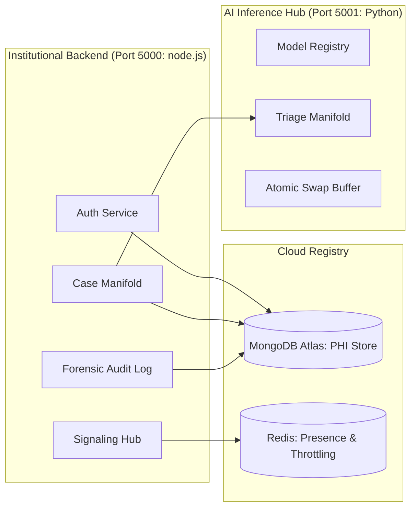
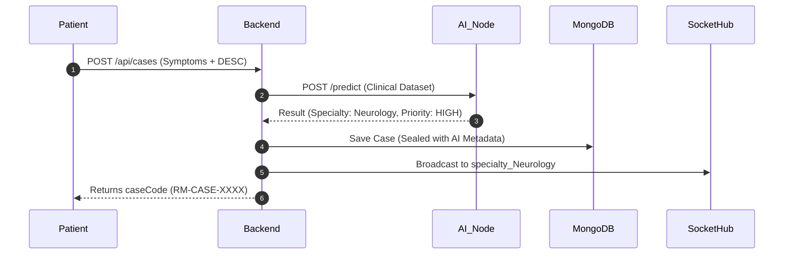
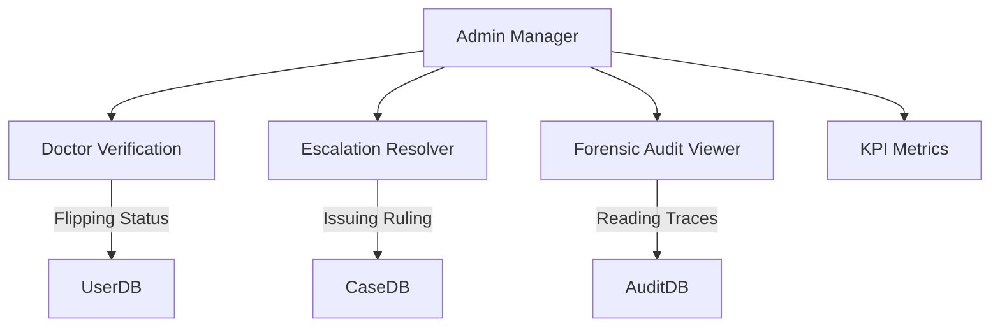

# Oelod RoboMed: Institutional Architectural Masterplan
> **Status:** Senior Developer Authorized · **Revision:** 2026.04.19 · **Classification:** Sovereign Document

This masterplan provides a character-perfect "Forensic Audit" and Operational Guide for the Oelod RoboMed clinical manifold. It is designed to enable total mastery of the system's industrial logic.

---

## 1. Statutory Architecture & Infrastructure Core
Before mapping participant flows, the structural "Handshake" must be mastered.

### **Core Infrastructure Manifolds:**
1.  **JWT Sovereignty**: The system uses **One-Time-Token Rotation (OTTR)** via `RefreshToken.js`. Every session handshake character-perfectly refreshes the access token, preventing clinical session hijacking.
2.  **Redis Persistence**:
    *   **Throttling**: `rate-limit-redis` character-perfectly prevents "DDoS Ingestion" at the API gate.
    *   **Presence**: The `online_users` set character-perfectly tracks clinical availability in real-time.
3.  **Atomic AI Swap**: The AI Node (Python) uses a staged buffer. New models are loaded into RAM before the global reference is character-perfectly swapped, ensuring zero-latency triage during updates.

---

## 2. The Patient Lifecycle (Clinical Ingestion Path)
The journey of a patient is a character-perfect "Request-to-Resolution" manifold.

### **2.1 Registration & Identity Handshake**
*   **The hospitalId**: Upon registration, the `idGen.js` utility character-perfectly generates a unique clinical identifier (e.g., `RM-2026-X4A`).
*   **Identity Escrow**: The patient's **Encryption Private Key** is character-perfectly backed up in the `IdentityEscrow` collection, allowing them to character-perfectly "Restore clinical sovereignty" on any device.

### **2.2 Case Creation & AI Triage Flow**

---

## 3. The Specialist Manifold (The Doctor's Journey)
The specialist registry is character-perfectly "Gated" by administrative sovereignty.

### **3.1 Professional Licensing Gate**
*   **Pending Status**: By default, all practitioners with the `doctor` role start in `pending` status.
*   **Statutory Approval**: The Administrator must character-perfectly review the `licenseNumber` and click **Approve**. This formally flips the status to `active` and "Unseals" the clinical queue.

### **3.2 Clinical Intervention Flow**
1.  **Acceptance**: A doctor uses the `acceptCase` manifold. This is **Atomic** (locked via `lockedAt` in MongoDB), preventing "Double-Inference" where two doctors might attempt to treat the same case simultaneously.
2.  **E2EE Consultation**: 
    *   The doctor retrieves the patient's `publicKey`.
    *   Communications via `ChatPanel.jsx` are character-perfectly encrypted using **AES-256-GCM**.
    *   **Telemedicine**: A WebRTC signaling handshake (`call_initiate`) triggers a direct peer-to-peer visual consultation.
3.  **Clinical Dictation**: Using `ClinicalVoiceRecorder`, the doctor can character-perfectly dictate findings. The AI Node character-perfectly "Transcribes" the audio and seals it into the Case Timeline.

---

## 4. Institutional Departments (Pharmacy & Lab)
These manifolds ensure the "Physical" clinical loop is character-perfectly traced.

### **4.1 Laboratory Routing**
*   **The Request**: A doctor issues a `LabRequest`. It appears character-perfectly in the `LabDashboard.jsx` queue.
*   **The Upload**: A Lab Technician uploads the diagnostic findings. The system character-perfectly links the file to the specific `CaseId`, notifying the doctor and patient immediately.

### **4.2 Pharmaceutical Fulfillment**
*   **Prescription Hub**: Doctors issue drugs. Prescriptions remain `isActive: true` until the case is closed.
*   **Dispensing Gate**: The Pharmacist must character-perfectly verify each medication in the dashboard before clicking **"Safe Closure."** This character-perfectly records the `pharmacistId` and timestamp for forensic audit.

---

## 5. Administrative Sovereignty & Governance
The Admins are the "Custodians of the Registry."

### **5.1 Forensic Audit & Voice Privacy Gate**
Every sensitive action character-perfectly triggers the `AuditLog.js` manifold:
*   **Voice Reporting Privacy**: Statutory audio reports are character-perfectly restricted to the **Patient**, **Clinicians (Doctors)**, and **Level 3 Super Admins**. All other personnel are formally redacted from this stream.
*   **PHI Accessed**: Every time clinical data is viewed, the `phiAccessed` flag is set.
*   **Operator Metadata**: Client IP and User Agent are character-perfectly recorded.
*   **Compliance Reports**: Admins can generate an industrial CSV report of all "Subject Identifiers" touched by a specific personnel member.

### **5.2 Clinical Escalation & Flagging**
*   **Flagging**: If a clinical discrepancy is identified, an Admin can "Flag" a case, locking certain actions until review.
*   **Escalation**: Serious matters can be character-perfectly rerouted to specific "Offices" (e.g., **CMO**, **Legal Dept**). Only a member of that specific office can character-perfectly "Issue a Ruling" to resolve the escalation.

---

## 6. Cryptographic Hardening (The Security Seal)
How RoboMed character-perfectly protects its participants.

| Manifold | Protocol | Purpose |
| :--- | :--- | :--- |
| **Data-In-Transit** | TLS 1.3 | Securing the tunnel between Browser and Registry. |
| **Field-Level Privacy** | AES-256-GCM | Encrypting `phoneNumber` in the Database Registry. |
| **Communications** | E2E Encryption | Encrypting internal chat messages using Participant Public Keys. |
| **Identity Backup** | PBKDF2 + AES | Securing Private Keys in the Escrow for user recovery. |

---

## 7. Integrated System Flow (Conclusion)
A case starts with a **Symptom**, is routed by **AI**, treated by a **Specialist**, validated by **Departments**, and audited by **Internal Governance**.

**Mastery Checklist for New Operators:**
1. [ ] **Register** and secure your `Identity Backup` passphrase.
2. [ ] **Verify** your status (Admins must approve Clinical Specialists).
3. [ ] **Observe** the AI Triage logs for specialty routing.
4. [ ] **Fulfill** Diagnostic or Pharamaceutical requests to proceed to Case Closure.
5. [ ] **Audit** the timeline to ensure every clinical coordinate is immutably sealed.
