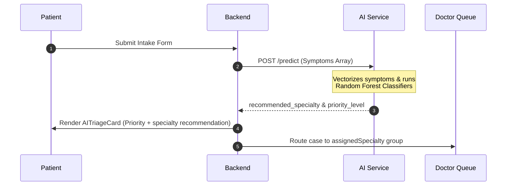
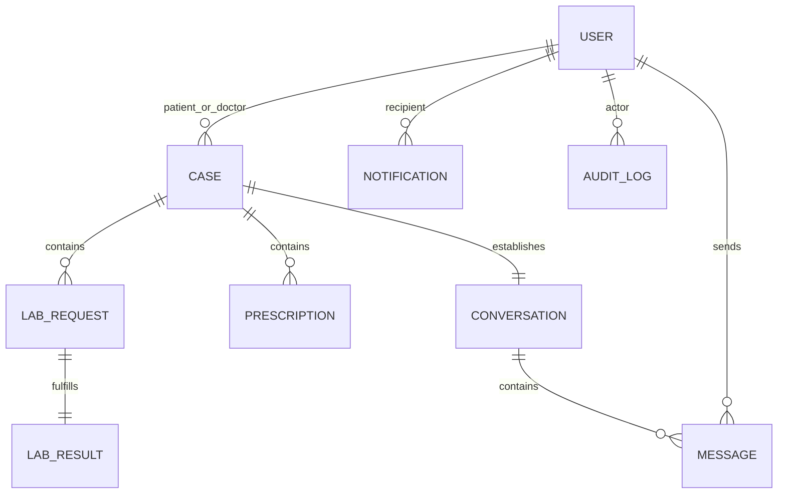
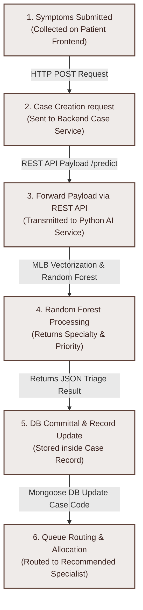

# Oelod RoboMed: Technical Report Design Documentation
> **Classification:** Technical Reference Document · **Author:** Antigravity Architect · **Date:** June 2026

This document maps out the core architectural designs of the **Oelod RoboMed** platform to be used directly in your Technical Report. It details the file paths, database schemas, logic definitions, and operational workflows for the six primary requested subsystems.

---

## Table of Contents
1. [User Model Design](#1-user-model-design)
2. [Case Lifecycle Design](#2-case-lifecycle-design)
3. [AI Triage Workflow](#3-ai-triage-workflow)
4. [Laboratory Workflow](#4-laboratory-workflow)
5. [Prescription Workflow](#5-prescription-workflow)
6. [Notification Workflow](#6-notification-workflow)
7. [AI Development & Training Procedures](#7-ai-development--training-procedures)
   - [7.1 Generation of Synthetic Symptom Records](#71-generation-of-synthetic-symptom-records)
   - [7.2 Symptom Vectorization Using MultiLabelBinarizer](#72-symptom-vectorization-using-multilabelbinarizer)
   - [7.3 Specialty Classification Using Random Forest](#73-specialty-classification-using-random-forest)
   - [7.4 Priority Classification Using Random Forest](#74-priority-classification-using-random-forest)
   - [7.5 Model Evaluation Using Test Data](#75-model-evaluation-using-test-data)
   - [7.6 Model Serialization for Deployment](#76-model-serialization-for-deployment)
8. [Detailed Backend Structure](#8-detailed-backend-structure)
9. [Backend Development Sequence (DFD / Flowchart)](#9-backend-development-sequence-dfd--flowchart)
10. [Frontend Development Sequence (DFD / Flowchart)](#10-frontend-development-sequence-dfd--flowchart)
11. [Comprehensive Database Schema Design](#11-comprehensive-database-schema-design)
12. [AI Triage Integration Sequence (DFD / Flowchart)](#12-ai-triage-integration-sequence-dfd--flowchart)

---

## 1. User Model Design

### 📂 File Locations
*   **Database Schema:** `backend/src/models/User.js`
*   **Business Logic / Services:** `backend/src/services/authService.js`
*   **Controller / Routing Gate:** `backend/src/controllers/authController.js`

### ⚙️ Design Overview & Architecture
The User Model controls the identity, role governance, security configuration, and cryptographic unsealing across all platform tiers.
1.  **Stratified Role-Based Isolation:** Users are registered with one or more roles: `patient`, `doctor`, `admin`, `lab`, and `pharmacist`. Role guards (`isAuth` and `roleGuard` middlewares) isolate routing paths based on these values.
2.  **Statutory Verification Status:** Practitioners (`doctor` role) default to a `pending` status upon registration, restricting queue access until verified and flipped to `active` by an administrator.
3.  **Unique Clinical Identification:** The system automatically generates sequential clinical identifiers (`hospitalId`, e.g., `HSP-1002`) and case codes via a counter schema to decouple human names from database indexes.
4.  **Field-Level Cipher Privacy:** Patient telephone numbers (`phoneNumber`) are encrypted-at-rest using **AES-256-GCM** inside Mongoose getters/setters, ensuring HIPAA/GDPR compliance.
5.  **Cryptographic Escrow & E2EE Keys:** Maintains a `publicKey` field to support End-to-End Encryption (E2EE) messaging between doctors and patients, and supports a recovery key escrow to restore account credentials via a backup pass-phrase.
6.  **Administrative Governance Levels:** Introduces `adminLevel` values from `0` (None) up to `3` (Super Admin) to gate access to sensitive operational offices (e.g., Chief Medical Office, Ethics Board).

### 📊 Database Schema Details (`User.js`)
```javascript
const userSchema = new mongoose.Schema({
  fullName: { type: String, required: true, trim: true },
  phoneNumber: { type: String, get: decrypt, set: encrypt }, // AES-256-GCM
  email: { type: String, required: true, unique: true, lowercase: true },
  password: { type: String, required: true, select: false },
  roles: { type: [String], enum: ['patient', 'doctor', 'admin', 'lab', 'pharmacist'], default: ['patient'] },
  activeRole: { type: String, default: 'patient' },
  hospitalId: { type: String, unique: true, sparse: true },
  specialization: { type: [String], default: [] },
  licenseNumber: { type: String, unique: true, sparse: true },
  age: { type: Number },
  gender: { type: String, enum: ['male', 'female', 'other'] },
  status: { type: String, enum: ['active', 'suspended', 'pending'], default: 'active' },
  adminLevel: { type: Number, default: 0, min: 0, max: 3 },
  roleRequest: {
    requestedRole: String,
    status: { type: String, enum: ['pending', 'approved', 'rejected'] },
    requestedAt: Date,
    reviewedAt: Date,
    reviewedBy: { type: mongoose.Schema.Types.ObjectId, ref: 'User' }
  },
  assignedOffice: { type: String, default: null },
  publicKey: { type: String, default: null }, // PEM public key for E2EE chats
  mustChangePassword: { type: Boolean, default: false }
}, { timestamps: true });
```

---

## 2. Case Lifecycle Design

### 📂 File Locations
*   **Database Schema:** `backend/src/models/Case.js`
*   **Business Logic / Services:** `backend/src/services/caseService.js`
*   **Controller / Routing Gate:** `backend/src/controllers/caseController.js`

### ⚙️ Design Overview & Architecture
The Case Schema is the single source of truth for patient-practitioner consultations, tracing complaints from inception to closure.
1.  **State Machine Transitions:** Cases move through explicit states:
    ```mermaid
    stateDiagram-v2
        [*] --> open : Patient Submits Symptoms
        open --> assigned : Doctor Accepts Case
        assigned --> in_progress : consultation starts
        in_progress --> flagged : Administrative Hold
        flagged --> resolved : Hold Lifted
        resolved --> in_progress
        in_progress --> closed : Pharmacy Dispensation & Closure
        closed --> [*]
    ```
2.  **Double-Acceptance Prevention:** To prevent race conditions where multiple doctors might accept a case simultaneously, the assignment update uses a Mongoose atomic `findOneAndUpdate` that verifies `lockedAt` is `null` and assigns a lock timestamp.
3.  **Forensic Audit Immortality:** Each case contains a `timeline` subdocument array. Sensitive operations (creation, assign, upload result, prescribe, close) append immutable entries documenting the action, user (`actorId`), timestamp, and metadata.
4.  **Clinical Dictation (O.V.R. Clerkship):** Attending doctors can dictate notes via a voice recorder interface. The recording is transcribed and sealed under `residentClerkship`, which compiles patient-facing explanations and technical medical assessments.

### 📊 Database Schema Details (`Case.js`)
```javascript
const caseSchema = new mongoose.Schema({
  caseCode: { type: String, unique: true },
  patient: { type: mongoose.Schema.Types.ObjectId, ref: 'User', required: true, index: true },
  doctor: { type: mongoose.Schema.Types.ObjectId, ref: 'User', index: true },
  symptoms: { type: [String], required: true },
  description: { type: String, set: encrypt, get: decrypt }, // Encrypted at-rest
  attachments: [{ fileUrl: String, publicId: String, uploadedAt: Date }],
  labResults: [{ fileUrl: String, fileName: String, publicId: String, uploadedBy: Schema.Types.ObjectId, uploadedAt: Date }],
  aiPrediction: {
    possible_conditions: [String],
    confidence_score: Number,
    priority_level: { type: String, enum: ['LOW', 'MEDIUM', 'HIGH'] },
    recommended_specialty: String,
    modelVersion: String,
    latency_ms: Number
  },
  residentClerkship: {
    title: String,
    history: [String],
    findings: mongoose.Schema.Types.Mixed,
    assessment: mongoose.Schema.Types.Mixed,
    residentNote: String,
    patientExplanation: String,
    sealedAt: Date
  },
  priority: { type: String, enum: ['low', 'medium', 'high', 'critical'], default: 'medium' },
  assignedSpecialty: { type: String, default: '' },
  status: { type: String, enum: ['open', 'assigned', 'in-progress', 'closed', 'flagged', 'escalated', 'resolved'], default: 'open', index: true },
  governanceNotes: [{ action: String, note: String, actorId: Schema.Types.ObjectId, office: String, timestamp: Date }],
  lockedAt: { type: Date, default: null },
  timeline: [{ event: String, actorId: Schema.Types.ObjectId, note: String, timestamp: Date, metadata: Schema.Types.Mixed }]
}, { timestamps: true });
```

---

## 3. AI Triage Workflow

### 📂 File Locations
*   **Backend Integration Interface:** `backend/src/services/aiService.js`
*   **Flask AI Microservice:** `ai-service/app.py`
*   **Model Training Pipelines:** `ai-service/model/train.py`, `ai-service/model/evaluate.py`

### ⚙️ Design Overview & Architecture
The AI Triage Engine acts as an independent diagnostic gatekeeper, routing patient intakes to human specialties without human intervention.


#### 🛡️ Circuit Breaker (API Level)
To prevent backend hanging during Flask down-times, `aiService.js` wraps outbound requests in a circuit breaker. If **3 consecutive failures** occur, the circuit opens for **30 seconds**, immediately bypassing the AI service to run fallback heuristics.

#### 🧠 Hybrid Cognitive Manifold & O.V.R. (Oelod Virtual Resident)
The triage workflow features a hybrid architecture combining statistical machine learning with conversational AI:
1.  **Natural Language Ingress:** Patients chat with the O.V.R. using conversational text.
2.  **Semantic Normalization:** SentenceTransformer models (`all-MiniLM-L6-v2`) parse patient description strings, matching them to normalized clinical terms (e.g., "left arm numbness" mapping to "brachial_radiation").
3.  **Triage Predictors:** The normalized symptom vector is passed to custom Random Forest models (`symptom_model.pkl` and `priority_model.pkl`) to yield the recommended medical specialty and urgency priority.
4.  **Generative Empathy Core:** Google Gemini API (`gemini-flash-lite-latest`) provides contextual, empathetic dialogue generation for general rapport.
5.  **Clinical Gravity Enforcement:** Strict rules govern the conversational threshold:
    *   **Polite Transition (5 Messages):** AI guides conversation topics back to physical symptoms.
    *   **Hard Switch (8 Messages):** If no clinical symptoms are detected after 8 exchanges, the AI halts open chat and forces the formal medical check-in page to load.

---

## 4. Laboratory Workflow

### 📂 File Locations
*   **Database Schemas:** 
    *   `backend/src/models/LabRequest.js`
    *   `backend/src/models/LabResult.js`
*   **Business Logic / Services:** `backend/src/services/labService.js`
*   **Controller / Gateway:** 
    *   `backend/src/controllers/caseController.js` (Doctor commands)
    *   `backend/src/controllers/departmentController.js` (Lab queue commands)

### ⚙️ Design Overview & Architecture
Decouples diagnostic ordering from the main consultation flow, integrating third-party lab technicians into the timeline.
1.  **Request Initiation:** The attending practitioner creates a `LabRequest` associated with a case ID. The request details `testType` (e.g., complete blood count) and `urgency` (`routine`, `urgent`, `stat`).
2.  **Department Queue Routing:** The request enters the unified lab queue (`LabDashboard.jsx`). Only users with the `lab` role can access this registry.
3.  **File Upload Gate:** Lab Technicians upload the completed PDF reports. Uploads pass through a Multer file-size restriction middleware and are pushed to cloud-hosted storage (Cloudinary).
4.  **Case Timeline Linking:** Once the technician uploads the results, the system creates a `LabResult` document that points to the parent `Case`, updates the `LabRequest` status to `completed`, pushes an automatic case timeline log, and alerts the physician.

### 📊 Database Schema Details (`LabRequest.js` & `LabResult.js`)
```javascript
// LabRequest.js
const labRequestSchema = new mongoose.Schema({
  caseId: { type: mongoose.Schema.Types.ObjectId, ref: 'Case', required: true, index: true },
  doctorId: { type: mongoose.Schema.Types.ObjectId, ref: 'User', required: true },
  testType: { type: String, required: true },
  urgency: { type: String, enum: ['routine', 'urgent', 'stat'], default: 'routine' },
  notes: { type: String, set: encrypt, get: decrypt },
  status: { type: String, enum: ['pending', 'completed', 'cancelled'], default: 'pending' }
}, { timestamps: true });

// LabResult.js
const labResultSchema = new mongoose.Schema({
  caseId: { type: mongoose.Schema.Types.ObjectId, ref: 'Case', required: true, index: true },
  requestId: { type: mongoose.Schema.Types.ObjectId, ref: 'LabRequest', default: null },
  fileUrl: { type: String, required: true },
  publicId: { type: String, required: true },
  mimeType: { type: String, required: true },
  sizeKb: { type: Number, required: true },
  comment: { type: String, default: '' },
  uploadedBy: { type: mongoose.Schema.Types.ObjectId, ref: 'User', required: true }
}, { timestamps: true });
```

---

## 5. Prescription Workflow

### 📂 File Locations
*   **Database Schema:** `backend/src/models/Prescription.js`
*   **Business Logic / Services:** `backend/src/services/prescriptionService.js`
*   **Controller / Gateway:** 
    *   `backend/src/controllers/caseController.js` (Doctor issuance)
    *   `backend/src/controllers/departmentController.js` (Pharmacist dispensing)

### ⚙️ Design Overview & Architecture
Enforces rigid checks on drug ordering, patient confirmation, and pharmaceutical fulfillment.
1.  **Prescription Composition:** Doctors issue medications as a sub-array (`drugs`) of the prescription. Each drug details the name, dosage, frequency, and custom patient instructions (encrypted-at-rest).
2.  **Safety Hold Constraints:** Prescriptions remain `isActive: true` until manually completed or overridden. The system prevents conflicting pharmacy orders for the same case.
3.  **Dual-Fulfillment Handshake:**
    *   **Patient Acknowledgment:** Patients must review and acknowledge their prescription (`acknowledgedByPatient = true`) in the portal.
    *   **Pharmacist Verification Gate:** The pharmacist verifies the drug details in the pharmacy dashboard, confirms physical distribution, and submits the checkout form.
4.  **Forensic Fulfillment Log:** Triggering "Safe Closure" records the `pharmacistId` and timestamp directly into the `actionLog`, resolving the prescription status to `dispensed`.

### 📊 Database Schema Details (`Prescription.js`)
```javascript
const medicineSchema = new mongoose.Schema({
  name: { type: String, required: true },
  dosage: { type: String, required: true },
  frequency: { type: String, required: true },
  duration: { type: String, required: true },
  instructions: { type: String, set: encrypt, get: decrypt },
  status: { type: String, enum: ['pending', 'dispensed', 'external'], default: 'pending' },
  fulfilledAt: Date,
  fulfilledBy: { type: mongoose.Schema.Types.ObjectId, ref: 'User' }
}, { _id: false });

const prescriptionSchema = new mongoose.Schema({
  caseId: { type: mongoose.Schema.Types.ObjectId, ref: 'Case', required: true, index: true },
  doctorId: { type: mongoose.Schema.Types.ObjectId, ref: 'User', required: true },
  drugs: [medicineSchema],
  notes: { type: String, set: encrypt, get: decrypt },
  isActive: { type: Boolean, default: true },
  status: { type: String, enum: ['pending', 'dispensed', 'partially_dispensed', 'cancelled', 'external'], default: 'pending' },
  actionLog: [{ action: String, actorId: Schema.Types.ObjectId, timestamp: Date, note: String }],
  acknowledgedByPatient: { type: Boolean, default: false },
  fulfilledAt: Date,
  fulfilledBy: { type: mongoose.Schema.Types.ObjectId, ref: 'User' }
}, { timestamps: true });
```

---

## 6. Notification Workflow

### 📂 File Locations
*   **Database Schema:** `backend/src/models/Notification.js`
*   **Business Logic / Services:** `backend/src/services/notificationService.js`
*   **Controller / Gateway:** `backend/src/controllers/notificationController.js`

### ⚙️ Design Overview & Architecture
Keeps patients and practitioners informed of critical clinical events in real time.
1.  **State Persistence:** Notifications are saved directly to MongoDB, enabling unread badges to persist across distinct devices and logins.
2.  **Socket.IO Presence Bridge:** When the backend triggers a notification event via `notificationService.js`, it dispatches it immediately to the active Socket.IO connections. Real-time updates include typing indicators, new messages, and queue assignments.
3.  **Categorized Event Types:** Outlines 10 system-recognized categories for notifications:
    *   `CASE_CREATED`: Patient submits an intake.
    *   `NEW_CASE_AVAILABLE`: Routed to specialty doctor queues.
    *   `CASE_ASSIGNED`: Case locked to a doctor.
    *   `CASE_CLOSED`: Consultation closed.
    *   `PRESCRIPTION_ISSUED`: Doctor orders medications.
    *   `PRESCRIPTION_ACKNOWLEDGED`: Patient accepts prescription instructions.
    *   `LAB_REQUESTED`: Doctor orders diagnostic labs.
    *   `LAB_RESULT_UPLOADED`: Lab Technician uploads files.
    *   `NEW_MESSAGE`: Real-time chat activity.
    *   `SYSTEM`: Administrative updates.
4.  **High-Urgency Pinning:** Critical priority alerts (`isPinned: true`) stick at the top of the user's dashboard feed and require manual dismissal.

### 📊 Database Schema Details (`Notification.js`)
```javascript
const notificationSchema = new mongoose.Schema({
  recipientId: { type: mongoose.Schema.Types.ObjectId, ref: 'User', required: true },
  title: { type: String, required: true },
  message: { type: String, required: true },
  type: {
    type: String,
    enum: [
      'CASE_CREATED', 'NEW_CASE_AVAILABLE', 'CASE_ASSIGNED', 'CASE_CLOSED',
      'PRESCRIPTION_ISSUED', 'PRESCRIPTION_ACKNOWLEDGED', 'LAB_REQUESTED',
      'LAB_RESULT_UPLOADED', 'NEW_MESSAGE', 'SYSTEM'
    ],
    required: true
  },
  relatedId: { type: mongoose.Schema.Types.ObjectId }, // Case or message reference
  isRead: { type: Boolean, default: false },
  priority: { type: String, enum: ['standard', 'high', 'critical'], default: 'standard' },
  isPinned: { type: Boolean, default: false }
}, { timestamps: true });
```

---

## 7. AI Development & Training Procedures

### 7.1 Generation of Synthetic Symptom Records
*   **📂 File Location:** `ai-service/model/generate_synthetic.py`
*   **⚙️ Method & Implementation:**
    *   **Disease Map Definition:** Organizes a dictionary structure mapping target specialties (e.g., Cardiology, Neurology, Pulmonology) to lists of tuples containing the disease name, core medical symptoms, and priority weight status (`high`, `medium`, `low`).
    *   **Noise Symptom Injection:** To simulate real-world patient ambiguity, the generator appends 0 to 3 random symptoms from a general `NOISE_SYMPTOMS` pool (e.g., `insomnia`, `back pain`, `anxiety`).
    *   **Core Symptom Dropping:** Incorporates a 20% probability of dropping 1 core symptom from the list to model case instances where patients forget relevant symptoms.
    *   **Linguistic Variant Substitution:** Employs a 40% probability of replacing clinical jargon with common slang or typos from a predefined mapping (e.g., mapping `"fever"` to `"running hot"` or `"feever"`, and `"chest pain"` to `"chest tightness"` or `"heart pain"`).
    *   **Conversational Wrappers:** Applies a 30% probability of prefixing symptoms with typical patient dialogue noise phrases (e.g., `"I'm really worried because"`, `"I noticed that"`).
    *   **Shuffled CSV Generation:** Generates a balanced set of 10,000 randomized records stored as a CSV manifest with column fields: `symptoms`, `specialty`, `priority`, and `possible_conditions`.

### 7.2 Symptom Vectorization Using MultiLabelBinarizer
*   **📂 File Location:** `ai-service/model/train.py` (Functions: `load_and_parse`, `build_features`)
*   **⚙️ Method & Implementation:**
    *   **Parsing Input Data:** Parses the input CSV, splits the semicolon-delimited symptom string, and sanitizes each entry by converting it to lowercase and removing leading/trailing whitespace:
        ```python
        df["symptom_list"] = df["symptoms"].str.split(";").apply(
            lambda lst: [s.strip().lower() for s in lst if s.strip()]
        )
        ```
    *   **MultiLabelBinarizer fit_transform:** Utilizes scikit-learn's `MultiLabelBinarizer` to encode the variable-length lists of raw tokens into a dense binary matrix $X$.
    *   **Dense Matrix Mapping:** Each column corresponds to a unique symptom present in the corpus dictionary. A row value of `1` indicates symptom presence, and a value of `0` indicates symptom absence. The fitted binarizer is serialized as `label_encoder.pkl` to transform inbound user symptoms during live inference.

### 7.3 Specialty Classification Using Random Forest
*   **📂 File Location:** `ai-service/model/train.py` (Function: `train_classifier`)
*   **⚙️ Method & Implementation:**
    *   **Model Initialization:** Configures a `RandomForestClassifier` with hyperparameter parameters: `n_estimators=200`, `class_weight="balanced"` (to counter imbalance issues across varying symptom counts), and `random_state=42`.
    *   **Multi-Core Utilization:** Leverages multi-threading (`n_jobs=-1`) to accelerate the bagging training iteration.
    *   **Stratified Splitting:** Uses a stratified train/test split (`test_size=0.2`) on the target labels to ensure identical class distributions inside both subsets.
    *   **Target Label Encoding:** Formats text label targets to numerical arrays using scikit-learn's `LabelEncoder` before model fitting, saved as `specialty_encoder.pkl`.

### 7.4 Priority Classification Using Random Forest
*   **📂 File Location:** `ai-service/model/train.py`
*   **⚙️ Method & Implementation:**
    *   **Separate Classifier Instance:** Operates a distinct `RandomForestClassifier` targeting the patient's triage priority levels: `LOW`, `MEDIUM`, and `HIGH`.
    *   **Hyperparameter Sync:** Uses parallel hyperparameters (`n_estimators=200`, `class_weight="balanced"`, `random_state=42`) matching the specialty classifier structure.
    *   **Encoder Target Mapping:** Maps string priority states (`LOW`/`MEDIUM`/`HIGH`) to numerical indices utilizing a `LabelEncoder` instance, serialized to disk as `priority_encoder.pkl`.

### 7.5 Model Evaluation Using Test Data
*   **📂 File Locations:** 
    *   `ai-service/model/evaluate.py`
    *   `ai-service/model/evaluation_results.json`
*   **⚙️ Method & Implementation:**
    *   **Statutory Threshold Enforcement:** Restricts model compilation by requiring a minimum overall accuracy of **85%** (`MIN_ACCURACY = 0.85`) and a per-class F1-score threshold of **75%** (`MIN_PER_CLASS_F1 = 0.75`).
    *   **Metrics Extraction:** Validates models against the 20% test subset split, reporting:
        *   **Weighted F1-Score** & **Overall Accuracy**
        *   **Confusion Matrix Display:** Computes a confusion matrix (`confusion_matrix(y_te, y_pred)`) converted to a pandas DataFrame mapping predictions directly against actual targets.
        *   **Per-Class Precision, Recall, and F1-Score**
    *   **Automated Verification:** Outputs metrics results directly to a serialized JSON manifest (`evaluation_results.json`) for audit pipelines.

### 7.6 Model Serialization for Deployment
*   **📂 File Locations:** `ai-service/model/` (PKL outputs)
*   **⚙️ Method & Implementation:**
    *   **joblib Serialization:** Employs the `joblib` library to serialize the fitted estimators, binarizer, and category encoders to binary files:
        ```python
        joblib.dump(clf_specialty, "symptom_model.pkl")
        joblib.dump(clf_priority,  "priority_model.pkl")
        joblib.dump(mlb,           "label_encoder.pkl")
        joblib.dump(le_specialty,  "specialty_encoder.pkl")
        joblib.dump(le_priority,   "priority_encoder.pkl")
        ```
    *   **Version Metadata Generation:** Increments the model patch version (e.g., from `1.0.0` to `1.0.1`) and writes training metadata to `model_info.json`, including:
        *   `version`: String representation of the model release iteration.
        *   `trained_at`: ISO timestamp tracking model training.
        *   `n_samples` & `n_specialties`: Training dataset attributes.
        *   `accuracy` & `f1_weighted`: Target performance metrics.
    *   **Zero-Downtime Hot Reloading:** The Flask microservice registers a secure `/reload-model` POST handler that executes `joblib.load()` on the serialized `.pkl` assets into a staging registry memory buffer, atomically replacing the references to avoid request dropping.

---

## 8. Detailed Backend Architecture & Folder Structure

The Oelod RoboMed backend is built as a production-grade, highly secure, and modular Node.js Express application. It adheres to clean architecture principles by separating routing, security screening, request handling, business workflows, and data access into distinct, maintainable layers.

### 8.1 Architectural Layering & Design Patterns


The backend follows a service-oriented MVC architecture structured as follows:

1. **Routing Layer (`src/routes/`):** Declares endpoint definitions and maps URI resources to corresponding controllers.
2. **Middleware Layer (`src/middlewares/`):** Interceptors that handle cross-cutting concerns:
   - **Rate Limiting (`rateLimiter.js`):** Enforces request caps on API endpoints (backed by memory/Redis).
   - **Authentication (`auth.js`):** Validates and verifies JWT access tokens.
   - **Authorization (`roleGuard.js`):** Restricts resource access to specific roles (e.g., `doctor`, `lab`, `pharmacist`, `admin`).
   - **Validation (`validate.js`):** Performs request schema verification using `joi`.
3. **Controller Layer (`src/controllers/`):** Acts as the system manager. Controllers decode request parameters, map inbound payload states, call the corresponding service methods, and format HTTP responses.
4. **Service Layer (`src/services/`):** The core engine containing all clinical workflows, business logic, email notifications, Cloudinary file uploads, and circuit-breaker-wrapped REST interactions with the Flask AI microservice.
5. **Database Models (`src/models/`):** Mongoose schemas defining MongoDB document formats, field-level encryption getters/setters, lifecycle pre-save hooks, and collection indexes.

```text
[ Client Request ] 
       │
       ▼
 [ Express Route ]  (src/routes/)
       │
       ▼
 [ Middlewares ]    (src/middlewares/) ──► Rate Limiter, Auth Guard, Role Check
       │
       ▼
 [ Controller ]     (src/controllers/) ──► Decodes Request Params, Invokes Service
       │
       ▼
 [ Service Layer ]  (src/services/)    ──► Computes Logic, Encrypts PHI, Calls AI
       │
       ▼
 [ Model / DB ]     (src/models/)      ──► Mongoose Commits to MongoDB
       │
       ▼
 [ JSON Response ]  ──► Returns Standard Envelope (src/utils/apiResponse.js)
```

### 8.2 Security & Data Privacy Architecture
*   **Field-Level Encryption (`src/utils/cryptoField.js`):** To comply with HIPAA/GDPR clinical privacy regulations, sensitive patient fields—such as `phoneNumber`, medical `description` notes, prescription `instructions`, and laboratory `notes`—are transparently encrypted using AES-256-GCM before database write operations and decrypted upon retrieval using Mongoose schema getters and setters.
*   **One-Time-Token (OTT) Refresh Rotation:** Prevents replay attacks by pairing a short-lived access JWT (15-minute expiry) with a single-use refresh token. Upon refresh, the old token is invalidated and removed from the database; any attempt to reuse an expired refresh token triggers immediate session revocation across all active devices for that identity.
*   **Cryptographic Key Escrow:** Patients and doctors generate public/private key pairs on the frontend (`publicKey` saved in `User` document) to facilitate end-to-end encrypted (E2EE) chat messages. Private keys are never transmitted to or stored on the backend.

### 8.3 Backend Monorepo Folder Structure

```text
backend/
├── .env                  # Environment keys & configurations
├── .env.example          # Template for setting environmental variables
├── Dockerfile            # Container definition to build and package backend
├── package.json          # Main Node application descriptor and dependencies
├── server.js             # Root server launcher, handles port orchestration
├── seed.js               # Database seeder utility to populate mockup entries
├── src/                  # Main application source code
│   ├── app.js            # Express application setup and middleware mounting
│   ├── config/           # Infrastructure credentials & vaults
│   │   ├── cloudinary.js     # Third-party assets configuration
│   │   ├── db.js             # Mongoose/MongoDB connection initializer
│   │   └── secretManager.js  # Production API key configuration
│   ├── controllers/      # Route handler controllers (decoders & gatekeepers)
│   │   ├── adminController.js
│   │   ├── authController.js
│   │   ├── caseController.js
│   │   ├── chatController.js
│   │   ├── dashboardController.js
│   │   ├── dataIngestionController.js
│   │   ├── departmentController.js
│   │   ├── ingestionController.js
│   │   ├── notificationController.js
│   │   ├── reportController.js
│   │   └── searchController.js
│   ├── models/           # Data models mapping MongoDB collections
│   │   ├── AnonymizedCase.js
│   │   ├── AuditLog.js
│   │   ├── Case.js
│   │   ├── Conversation.js
│   │   ├── IdentityEscrow.js
│   │   ├── LabRequest.js
│   │   ├── LabResult.js
│   │   ├── Message.js
│   │   ├── Notification.js
│   │   ├── Prescription.js
│   │   ├── RefreshToken.js
│   │   ├── Report.js
│   │   └── User.js
│   ├── services/         # Core business logic processing files
│   │   ├── aiService.js
│   │   ├── auditService.js
│   │   ├── authService.js
│   │   ├── caseService.js
│   │   ├── chatService.js
│   │   ├── cloudinaryService.js
│   │   ├── dataIngestionService.js
│   │   ├── emailService.js
│   │   ├── ingestionService.js
│   │   ├── labService.js
│   │   ├── notificationService.js
│   │   ├── prescriptionService.js
│   │   ├── reportService.js
│   │   └── searchService.js
│   ├── routes/           # Endpoint definition mappings (Express Routers)
│   │   ├── admin.routes.js
│   │   ├── aiExperimentRoutes.js
│   │   ├── auth.routes.js
│   │   ├── case.routes.js
│   │   ├── chat.routes.js
│   │   ├── dashboard.routes.js
│   │   ├── department.routes.js
│   │   ├── ingestion.routes.js
│   │   ├── notification.routes.js
│   │   ├── report.routes.js
│   │   └── search.routes.js
│   ├── middlewares/      # Security guards, verification, and limits
│   │   ├── auth.js
│   │   ├── errorHandler.js
│   │   ├── rateLimiter.js
│   │   ├── roleGuard.js
│   │   ├── upload.js
│   │   └── validate.js
│   ├── repositories/     # Database collection abstraction layer
│   │   └── userRepository.js
│   ├── utils/            # Helper scripts and formatters
│   │   ├── apiResponse.js
│   │   ├── crypto.js
│   │   ├── cryptoField.js
│   │   ├── csvExport.js
│   │   ├── generateToken.js
│   │   ├── idGen.js
│   │   ├── redisClient.js
│   │   ├── reportGenerator.js
│   │   └── uploadFile.js
│   ├── sockets/          # WebSocket controllers
│   │   └── index.js
│   ├── events/           # Custom event emitter and listeners
│   │   ├── emitter.js
│   │   └── socketListeners.js
│   └── ai-experiment/    # Development & test intelligence manifolds
│       ├── ClinicalTranslator.js
│       ├── IntelligenceService.js
│       ├── LearningService.js
│       ├── VirtualResident.js
│       ├── simulate-vr.js
│       ├── test-intelligence.js
│       └── data-vault/
└── tests/                # Test suites & environment configuration
```

---

## 9. Backend Development Sequence (DFD / Flowchart)

The flowchart below traces the sequential progression of the backend development phases. It illustrates the architectural dependencies where each completed component serves as the foundation for the subsequent phase.

```mermaid
flowchart TD
    classDef phase fill:#efebe9,stroke:#5d4037,stroke-width:2px,color:#3e2723;
    classDef files fill:#efebe9,stroke:#5d4037,stroke-width:1px,color:#3e2723;
    classDef dependency stroke:#0288d1,stroke-width:1.5px,stroke-dasharray: 4;

    %% --- Phase 1 ---
    subgraph P1 ["Phase 1: Server Setup & Configuration"]
        Step1["1. Setup Server & Middleware"]:::phase
        Files1["server.js<br/>app.js<br/>rateLimiter.js<br/>errorHandler.js"]:::files
        Step1 --> Files1
    end

    %% --- Phase 2 ---
    subgraph P2 ["Phase 2: Database & Data Models"]
        Step2["2. Establish Connection & Schemas"]:::phase
        Files2["config/db.js<br/>User.js<br/>Case.js<br/>Notification.js"]:::files
        Step2 --> Files2
    end
    Files1 -.->|Provides Port Hosting| Step2:::dependency

    %% --- Phase 3 ---
    subgraph P3 ["Phase 3: Identity & Role Security"]
        Step3["3. Authentication & Authorization"]:::phase
        Files3["authService.js<br/>authController.js<br/>auth.js (Middleware)<br/>roleGuard.js"]:::files
        Step3 --> Files3
    end
    Files2 -.->|Injects Schema Structures| Step3:::dependency

    %% --- Phase 4 ---
    subgraph P4 ["Phase 4: Consultation Workflows"]
        Step4["4. Case Management & Lifecycle"]:::phase
        Files4["caseService.js<br/>caseController.js<br/>Case Timeline Array<br/>Atomic lockedAt Locks"]:::files
        Step4 --> Files4
    end
    Files3 -.->|Enforces Security Guards| Step4:::dependency

    %% --- Phase 5 ---
    subgraph P5 ["Phase 5: Medical Machine Learning Gateway"]
        Step5["5. AI Triage Request Integration"]:::phase
        Files5["aiService.js (with Circuit Breaker)<br/>REST calls to Python microservice"]:::files
        Step5 --> Files5
    end
    Files4 -.->|Initiates Symptom Vectors| Step5:::dependency

    %% --- Phase 6 ---
    subgraph P6 ["Phase 6: Specialized Department Nodes"]
        Step6["6. Laboratory & Pharmacy Modules"]:::phase
        Files6["labService.js<br/>prescriptionService.js<br/>LabRequest.js & LabResult.js<br/>Prescription.js Schema"]:::files
        Step6 --> Files6
    end
    Files5 -.->|Matches to Doctor Specialty| Step6:::dependency

    %% --- Phase 7 ---
    subgraph P7 ["Phase 7: Real-Time Sockets & Alerts"]
        Step7["7. Sockets & Push Notifications"]:::phase
        Files7["sockets/index.js<br/>events/socketListeners.js<br/>notificationService.js<br/>Notification.js Schema"]:::files
        Step7 --> Files7
    end
    Files6 -.->|Triggers Lab / Pharm Updates| Step7:::dependency

    %% --- Phase 8 ---
    subgraph P8 ["Phase 8: Audit, Administration & Logs"]
        Step8["8. Audit Logs & Governance Controls"]:::phase
        Files8["auditService.js<br/>adminController.js<br/>AdminLevel Escalations<br/>CSV Governance Reports"]:::files
        Step8 --> Files8
    end
    Files7 -.->|Broadcasts Status Alerts| Step8:::dependency
```




### Detailed Sequential Narrative

1. **Setup of Server Environment & Middleware Configuration:** Scaffolds the basic Node.js Express framework using `server.js` and `app.js`. It mounts global configurations like CORS, routing entry points, standard rate limiting (`rateLimiter.js`), and centralized error interception (`errorHandler.js`).
2. **Creation of Database Connection & Schema Models:** Initializes the MongoDB connections via Mongoose in `config/db.js`. Defines structural collections for operational storage: `User`, `Case`, `LabRequest`, `Prescription`, and `Notification`.
3. **Implementation of Authentication & Authorization Services:** Integrates JWT password security and verification token logic in `authService.js`. Enforces role-based endpoint isolation via `auth.js` and `roleGuard.js` middlewares.
4. **Implementation of Case Management & Workflow Services:** Implements endpoints for clinical case creation, state transitions, atomic lock mechanisms to prevent race conditions during acceptance (`lockedAt`), and appends logs to the immutable case `timeline`.
5. **Integration of AI Triage Request Handling:** Connects the backend case creation lifecycle to the Python Flask microservice using `aiService.js`. Integrates a circuit breaker mechanism that intercepts failures to preserve system uptime.
6. **Implementation of Laboratory & Pharmacy Modules:** Integrates secondary specialist actions including lab requests, file uploads to Cloudinary storage (`labService.js`), active prescription limits, and pharmacist dispense gates (`prescriptionService.js`).
7. **Implementation of Real-Time Communication & Notification Services:** Mounts Socket.io triggers to enable instant doctor-patient messaging, typing indicators, and real-time alert broadcasts using the `notificationService.js` collector.
8. **Implementation of Audit, Governance, & Administrative Control Services:** Secures critical actions via audit log collection (`auditService.js`), handles admin-level escalation parameters and doctor status changes, and exports spreadsheet compliance reviews.

---

## 10. Frontend Development Sequence (DFD / Flowchart)

The flowchart below outlines the frontend development workflow. It visualizes the step-by-step assembly of the client-side user portal, mapping the dependency relationships between key rendering routes, context providers, and role-reactive dashboards.

```mermaid
flowchart TD
    classDef phase fill:#efebe9,stroke:#5d4037,stroke-width:2px,color:#3e2723;
    classDef files fill:#efebe9,stroke:#5d4037,stroke-width:1px,color:#3e2723;
    classDef dependency stroke:#0288d1,stroke-width:1.5px,stroke-dasharray: 4;

    %% --- Phase 1 ---
    subgraph F1_Scaffold ["Phase 1: Project Scaffold & Routing"]
        StepF1["1. Scaffold & Route Mapping"]:::phase
        FilesF1["main.jsx<br/>App.jsx (Router)<br/>index.css (Design System)"]:::files
        StepF1 --> FilesF1
    end

    %% --- Phase 2 ---
    subgraph F2_Auth ["Phase 2: Identity & Session Gating"]
        StepF2["2. Authentication Interfaces"]:::phase
        FilesF2["AuthContext.jsx<br/>AuthPage.jsx (Login/Register)<br/>Private Routes (Auth Gates)"]:::files
        StepF2 --> FilesF2
    end
    FilesF1 -.->|Provides Route Structure| StepF2:::dependency

    %% --- Phase 3 ---
    subgraph F3_Dash ["Phase 3: Role-Aware Portals"]
        StepF3["3. Role-Based Dashboards"]:::phase
        FilesF3["PatientDashboard.jsx<br/>DoctorDashboard.jsx<br/>Dashboard Widgets"]:::files
        StepF3 --> FilesF3
    end
    FilesF2 -.->|Injects Token Session & Roles| StepF3:::dependency

    %% --- Phase 4 ---
    subgraph F4_Case ["Phase 4: Consultation Interface"]
        StepF4["4. Case Interaction Pages"]:::phase
        FilesF4["NewCasePage.jsx (Symptom Form)<br/>CaseDetailPage.jsx<br/>AITriageCard Component"]:::files
        StepF4 --> FilesF4
    end
    FilesF3 -.->|Links from Patient/Doctor Feed| StepF4:::dependency

    %% --- Phase 5 ---
    subgraph F5_Comm ["Phase 5: Sockets & Communications"]
        StepF5["5. Live Alerting & Chat Panels"]:::phase
        FilesF5["SocketContext.jsx<br/>NotificationContext.jsx<br/>ChatPanel (E2EE AES)<br/>TelemedicineContext.jsx (WebRTC)"]:::files
        StepF5 --> FilesF5
    end
    FilesF4 -.->|Embeds inside Case Detail view| StepF5:::dependency

    %% --- Phase 6 ---
    subgraph F6_Dept ["Phase 6: Specialized Department Pages"]
        StepF6["6. Lab & Pharmacy Dashboards"]:::phase
        FilesF6["LabDashboard.jsx (Upload Gate)<br/>PharmacyDashboard.jsx (Checkout Gate)"]:::files
        StepF6 --> FilesF6
    end
    FilesF5 -.->|Broadcasts real-time events| StepF6:::dependency

    %% --- Phase 7 ---
    subgraph F7_Admin ["Phase 7: Governance & Administration"]
        StepF7["7. Administrative Control Panels"]:::phase
        FilesF7["AdminDashboard.jsx (Role Verifier)<br/>AdminReportsPage.jsx (Audit PDF)"]:::files
        StepF7 --> FilesF7
    end
    FilesF6 -.->|Exposes Action Logs| StepF7:::dependency
```




### Detailed Sequential Narrative

1. **Creation of the Project Structure & Route Definitions:** Scaffolds the React 18 single-page application under Vite, configuring `main.jsx` and the top-level `App.jsx` React-Router routing pathways. Applies the custom vanilla CSS styling framework inside `index.css`.
2. **Implementation of Authentication Interfaces:** Creates the `AuthContext.jsx` session management loop, supporting persistent token tokens, role-switching, and rendering the custom `AuthPage.jsx` (providing user forms, validation, and cryptographic key generation).
3. **Implementation of Role-Based Dashboards:** Implements user portals customized to the active session role: `PatientDashboard.jsx` (showing active cases and diagnostic summaries), `DoctorDashboard.jsx` (showing the clinical triage queue), and dashboard widgets.
4. **Development of Case Interaction Pages:** Implements `NewCasePage.jsx` for patient symptom collection and the detailed `CaseDetailPage.jsx` panel. Renders clinical information panels including `AITriageCard`, chat logs, and timelines.
5. **Implementation of Notification & Communication Views:** Configures real-time messaging modules using `SocketContext.jsx` and WebRTC telemedicine modules using `TelemedicineContext.jsx`. Mounts the secure message input inside the case detail view, encrypting contents client-side using participant public keys.
6. **Implementation of Laboratory & Pharmacy Workflow Pages:** Configures queues for specialized roles: `LabDashboard.jsx` (enabling lab technicians to review test requisitions and upload PDF results) and `PharmacyDashboard.jsx` (enabling pharmacists to review active medication lists and dispatch prescriptions).
7. **Implementation of Administrative Control Interfaces:** Integrates system control boards under `AdminDashboard.jsx` (enabling role requests, status overrides, and user suspensions) and `AdminReportsPage.jsx` (for fetching clinical audit trails).

---

## 11. Comprehensive Database Schema Design

The diagram below shows the Entity-Relationship Diagram (ERD) mapping the dependencies and key relations across the platform's collections.



### 11.1 Users Schema (`User.js`)
*   **Purpose:** The central identity authority mapping security roles (`patient`, `doctor`, `admin`, `lab`, `pharmacist`), credential hashes, and cryptographic key parameters.
*   **Mongoose Definition:**
```javascript
const userSchema = new mongoose.Schema(
  {
    fullName: {
      type: String,
      required: [true, 'Full name is required'],
      trim: true,
      minlength: [2, 'Name must be at least 2 characters'],
      maxlength: [100, 'Name cannot exceed 100 characters'],
    },
    phoneNumber: {
      type: String,
      trim: true,
      get: decrypt,
      set: encrypt, // Field-level encryption for HIPAA/GDPR PII safety
    },
    email: {
      type: String,
      required: [true, 'Email is required'],
      unique: true,
      lowercase: true,
      trim: true,
    },
    password: {
      type: String,
      required: [true, 'Password is required'],
      select: false, // Prevents accident leak in queries
    },
    roles: {
      type: [String],
      enum: ['patient', 'doctor', 'admin', 'lab', 'pharmacist'],
      default: ['patient'],
    },
    activeRole: { type: String, default: 'patient' },
    hospitalId: { type: String, unique: true, sparse: true },
    specialization: { type: [String], default: [] },
    licenseNumber: { type: String, unique: true, sparse: true },
    status: {
      type: String,
      enum: ['active', 'suspended', 'pending'],
      default: 'active'
    },
    adminLevel: { type: Number, default: 0, min: 0, max: 3 },
    publicKey: { type: String, default: null } // Escrow PEM key for Chat E2EE
  },
  { timestamps: true }
);
```

### 11.2 Cases Schema (`Case.js`)
*   **Purpose:** Traces consulting timelines, resident summaries, AI priorities, and governance notes.
*   **Mongoose Definition:**
```javascript
const caseSchema = new mongoose.Schema(
  {
    caseCode: { type: String, unique: true },
    patient: { type: mongoose.Schema.Types.ObjectId, ref: 'User', required: true, index: true },
    doctor: { type: mongoose.Schema.Types.ObjectId, ref: 'User', index: true },
    symptoms: { type: [String], required: true },
    description: { 
      type: String, 
      set: encrypt,
      get: decrypt // Decrypts only on retrieval
    },
    attachments: [{ fileUrl: String, publicId: String }],
    labResults: [{
      fileUrl: String,
      fileName: String,
      uploadedBy: { type: mongoose.Schema.Types.ObjectId, ref: 'User' }
    }],
    aiPrediction: {
      possible_conditions: [String],
      confidence_score: Number,
      priority_level: { type: String, enum: ['LOW', 'MEDIUM', 'HIGH'] },
      recommended_specialty: String
    },
    residentClerkship: {
      title: String,
      history: [String],
      findings: mongoose.Schema.Types.Mixed,
      assessment: mongoose.Schema.Types.Mixed,
      residentNote: String,
      patientExplanation: String,
      sealedAt: Date
    },
    priority: { type: String, enum: ['low', 'medium', 'high', 'critical'], default: 'medium' },
    assignedSpecialty: { type: String, default: '' },
    status: {
      type: String,
      enum: ['open', 'assigned', 'in-progress', 'closed', 'flagged', 'escalated', 'resolved'],
      default: 'open',
      index: true
    },
    lockedAt: { type: Date, default: null }, // Prevents acceptance race conditions
    timeline: [{
      event: { type: String, required: true },
      actorId: { type: mongoose.Schema.Types.ObjectId, ref: 'User' },
      note: String,
      timestamp: { type: Date, default: Date.now }
    }]
  },
  { timestamps: true }
);
```

### 11.3 Prescriptions Schema (`Prescription.js`)
*   **Purpose:** Dispense control manifest with patient instruction encryption and verification log.
*   **Mongoose Definition:**
```javascript
const prescriptionSchema = new mongoose.Schema(
  {
    caseId: { type: mongoose.Schema.Types.ObjectId, ref: 'Case', required: true, index: true },
    doctorId: { type: mongoose.Schema.Types.ObjectId, ref: 'User', required: true },
    drugs: [{
      name: { type: String, required: true },
      dosage: { type: String, required: true },
      frequency: { type: String, required: true },
      duration: { type: String, required: true },
      instructions: { type: String, set: encrypt, get: decrypt },
      status: { type: String, enum: ['pending', 'dispensed', 'external'], default: 'pending' }
    }],
    notes: { type: String, set: encrypt, get: decrypt },
    isActive: { type: Boolean, default: true },
    status: {
      type: String,
      enum: ['pending', 'dispensed', 'partially_dispensed', 'cancelled', 'external'],
      default: 'pending',
    },
    actionLog: [{
      action: String,
      actorId: { type: mongoose.Schema.Types.ObjectId, ref: 'User' },
      timestamp: { type: Date, default: Date.now },
      note: String
    }],
    acknowledgedByPatient: { type: Boolean, default: false }
  },
  { timestamps: true }
);
```

### 11.4 Laboratory Requests Schema (`LabRequest.js`)
*   **Purpose:** Doctor orders for diagnostic scans and diagnostic tests.
*   **Mongoose Definition:**
```javascript
const labRequestSchema = new mongoose.Schema(
  {
    caseId: { type: mongoose.Schema.Types.ObjectId, ref: 'Case', required: true, index: true },
    doctorId: { type: mongoose.Schema.Types.ObjectId, ref: 'User', required: true },
    testType: { type: String, required: true },
    urgency: { type: String, enum: ['routine', 'urgent', 'stat'], default: 'routine' },
    notes: { type: String, set: encrypt, get: decrypt },
    status: { type: String, enum: ['pending', 'completed', 'cancelled'], default: 'pending' }
  },
  { timestamps: true }
);
```

### 11.5 Laboratory Results Schema (`LabResult.js`)
*   **Purpose:** Links technicians' uploaded test findings to their parent requests and case timeline.
*   **Mongoose Definition:**
```javascript
const labResultSchema = new mongoose.Schema(
  {
    caseId: { type: mongoose.Schema.Types.ObjectId, ref: 'Case', required: true, index: true },
    requestId: { type: mongoose.Schema.Types.ObjectId, ref: 'LabRequest', default: null },
    fileUrl: { type: String, required: true },
    publicId: { type: String, required: true },
    mimeType: { type: String, required: true },
    sizeKb: { type: Number, required: true },
    comment: { type: String, default: '' },
    uploadedBy: { type: mongoose.Schema.Types.ObjectId, ref: 'User', required: true }
  },
  { timestamps: true }
);
```

### 11.6 Notifications Schema (`Notification.js`)
*   **Purpose:** System-generated live presence cues and notifications.
*   **Mongoose Definition:**
```javascript
const notificationSchema = new mongoose.Schema(
  {
    recipientId: { type: mongoose.Schema.Types.ObjectId, ref: 'User', required: true, index: true },
    title: { type: String, required: true },
    message: { type: String, required: true },
    type: {
      type: String,
      enum: [
        'CASE_CREATED', 'NEW_CASE_AVAILABLE', 'CASE_ASSIGNED', 'CASE_CLOSED',
        'PRESCRIPTION_ISSUED', 'PRESCRIPTION_ACKNOWLEDGED', 'LAB_REQUESTED',
        'LAB_RESULT_UPLOADED', 'NEW_MESSAGE', 'SYSTEM'
      ],
      required: true
    },
    relatedId: { type: mongoose.Schema.Types.ObjectId },
    isRead: { type: Boolean, default: false },
    priority: { type: String, enum: ['standard', 'high', 'critical'], default: 'standard' },
    isPinned: { type: Boolean, default: false }
  },
  { timestamps: true }
);
```

### 11.7 Audit Logs Schema (`AuditLog.js`)
*   **Purpose:** Write-once log capturing administrator overrides, professional upgrades, and PHI access.
*   **Mongoose Definition:**
```javascript
const auditLogSchema = new mongoose.Schema(
  {
    actorId: { type: mongoose.Schema.Types.ObjectId, ref: 'User', required: true, index: true },
    action: { type: String, required: true, trim: true },
    targetId: { type: mongoose.Schema.Types.ObjectId, ref: 'User' },
    targetType: { type: String, default: 'User' },
    metadata: { type: mongoose.Schema.Types.Mixed, default: {} },
    phiAccessed: { type: Boolean, default: false },
    clientIp: { type: String },
    userAgent: { type: String }
  },
  { timestamps: true }
);
```

### 11.8 Chat Messages Schema (`Conversation.js` & `Message.js`)
*   **Purpose:** Models patient-doctor E2EE secure messages mapped to individual consultation cases.
*   **Mongoose Definitions:**
```javascript
// Conversation Model
const conversationSchema = new mongoose.Schema(
  {
    caseId: { type: mongoose.Schema.Types.ObjectId, ref: 'Case', required: true, unique: true },
    participants: [{ type: mongoose.Schema.Types.ObjectId, ref: 'User' }],
    lastMessage: { type: mongoose.Schema.Types.ObjectId, ref: 'Message' }
  },
  { timestamps: true }
);

// Message Model
const messageSchema = new mongoose.Schema(
  {
    conversationId: { type: mongoose.Schema.Types.ObjectId, ref: 'Conversation', required: true, index: true },
    sender: { type: mongoose.Schema.Types.ObjectId, ref: 'User', required: true },
    text: { type: String }, // Contains the AES E2EE encrypted ciphertext string
    isEncrypted: { type: Boolean, default: false },
    attachments: [{ fileUrl: String, mimeType: String }],
    readBy: [{ type: mongoose.Schema.Types.ObjectId, ref: 'User' }]
  },
  { timestamps: true }
);
```

---

## 12. AI Triage Integration Sequence (DFD / Flowchart)

The flowchart below visualizes the 6-step integration process where incoming patient symptom submissions are processed by the machine learning classifiers to determine specialty recommendations and routing priorities.




### Detailed Sequence Narrative

1. **Symptom Data Submission:** The patient selects symptoms and describes their condition using the React frontend application (`NewCasePage.jsx`), which groups this data into a structured JSON body.
2. **Backend Case Ingestion:** The frontend submits the case payload to the Node.js Express backend via the `POST /api/cases` route. The request hits `caseController.js` and is passed to `caseService.js` for initial structural validation.
3. **AI Service REST Request:** `caseService.js` delegates the symptom array to the circuit-breaker-protected `aiService.js` module. The backend initiates a RESTful HTTP POST request to the Python Flask microservice endpoint `/predict`.
4. **AI Triage Processing:** The Python Flask AI microservice (`app.py`) parses the symptoms, converts them to binary indicators via `MultiLabelBinarizer`, and runs the specialty and priority Random Forest classification models (`train.py`). The microservice yields predictions along with confidence scores and latency metrics.
5. **Database Case Update:** The backend receives the JSON response, validates its structure, and commits the triage metrics (`possible_conditions`, `recommended_specialty`, `priority_level`, `confidence_score`, and model metadata) directly into the MongoDB case document using the `Case` Mongoose model.
6. **Specialist Queue Routing:** The case state updates, triggering WebSocket notifications to the clinical queue. Doctors matched to the predicted specialty (e.g., *Cardiology*, *Neurology*) immediately receive alerts on their `DoctorDashboard.jsx` screen, facilitating prompt review and appointment booking.

